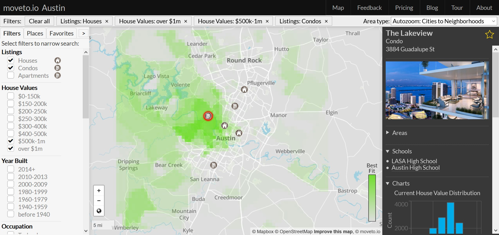
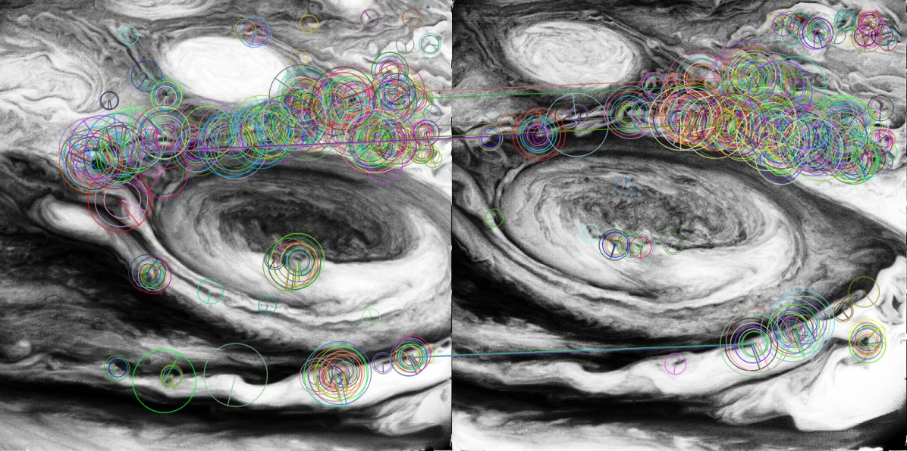

# Brian Burns

## About Me

Hello! I'm a developer interested in machine learning, Python, physics, and React. 

Currently I'm working on moveto.io with a small team.

## Projects

### moveto.io

A map-based neighborhood and investment guide

<https://moveto.io>

### PyVoyager

Semi-automated construction of movies from the 70k+ images sent back from the Voyager probes

<https://github.com/bburns/PyVoyager>

## Contact

* <bburns.km@gmail.com>
* <https://github.com/bburns>
* <http://www.linkedin.com/in/bburnskm>
* <https://twitter.com/bburnskm>
* <https://stackoverflow.com/users/243392/brian-burns?tab=profile>
